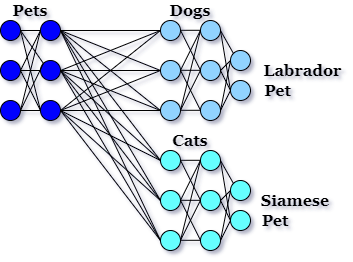

# A-NN_Classifier

###### ML Team: Arboreal Neural Network Classifier

A) Based on the following link, present methods for AI humor generation fall into 2 categories: [https://aclanthology.org/2020.latechclfl-1.4.pdf](https://aclanthology.org/2020.latechclfl-1.4.pdf)
1. Largely human input based (e.g., templates)
2. Machine Learning techniques
3. A hybrid
Based on the paper, the funniness of the generated joke is directly proportional to human input - the more machine learning, the less funny the jokes.

B) Based on the video in the following link: https://www.infoq.com/presentations/nlp-machine-learning-meaning-text/, language is both complex and domain-specific. 
Therefore, (albeit as of 2017, when the presentation in the video was made), training any sort of understanding of language requires great human effort building a specific system that will work on a specific area of language. 
A project for understanding language about music would not apply to a project to understand medical language, which would not apply to cooking.

C) My belief is that incongruency is fundamental to humor. Identifying and creating incongruency is therefore essential to making funny jokes.

D) One cannot consistently create incongruency without understanding how concepts are classified. 
For example, there is nothing funny about the concept 'Dog' going along with 'Pet', since the concept of 'Dog' is closely related to the concept of 'Pet'. 
There might be something funny with the concept of 'Dog' going along with 'Iceberg’ if some relationship could be found - because 'Dog' is not usually associated with 'Iceberg'. 
For example: Why do Great Danes avoid ice? Because they are Titanic! (Yes, I made that up just now based on this algorithm!) :)

E) In order to make jokes, therefore, we need to have a tool which will classify automatically and understand very different areas of language - the more variety, and farther apart, the better. It is not enough to train a model to learn Dogs - it must understand Dogs, to the extent that it knows that Great Danes are big - and relate that to knowledge of another specific area - ships, and the knowledge that the ship 'Titanic' had a negative event happen in relation to ice - and also to connect the idea of 'Titanic' to the word 'big'!
There is no technology presently that can do this.

F) There is a Dataset that might be able to help: [https://wordnet.princeton.edu/](https://aclanthology.org/2020.latechclfl-1.4.pdf)
However, that Dataset is created manually. One option is to use that manual dataset to find farfetched connections to do the kind of thing I did above.
This does not solve the problem of making the classifications automatic, however. It involves humans at a very basic level, which is what we want to avoid.

**My proposal:**

A new type of Neural Network, which will automatically classify as it goes.
1. A regular neural network will train on a single concept, 'Dog', for example training to find different types of dogs.
2. When a different concept comes along, 'Cat', the early layers of the Neural Network will not experience much activity - they classify if an animal is a pet or not, and 'Cat' has a lot of similarity to 'Dog' here. However, the later layers of neurons will have a large amount of activity, because they must completely retrain themselves.
3. Therefore, when the amount of activity of neurons in a layer rises above a threshold, I propose that a new extension of the neural network be created. This extension will share the previous neurons, but have different neurons for the more active, later layers.
Advantages:
1. The ability to simultaneously classify concepts across categories. A Labrador is not only classified as a type of Dog - it is classified as being like a Cat.
2. Training separate, related concepts at the same time. Even though I only have data about Cats, I am improving my Dog knowledge, since it shares neurons that are trained when Cat data is trained.
3. No Dirty Data - Cat data thrown into a set of Dog data will not confuse the network. Instead, Cat data will be separated out automatically.

